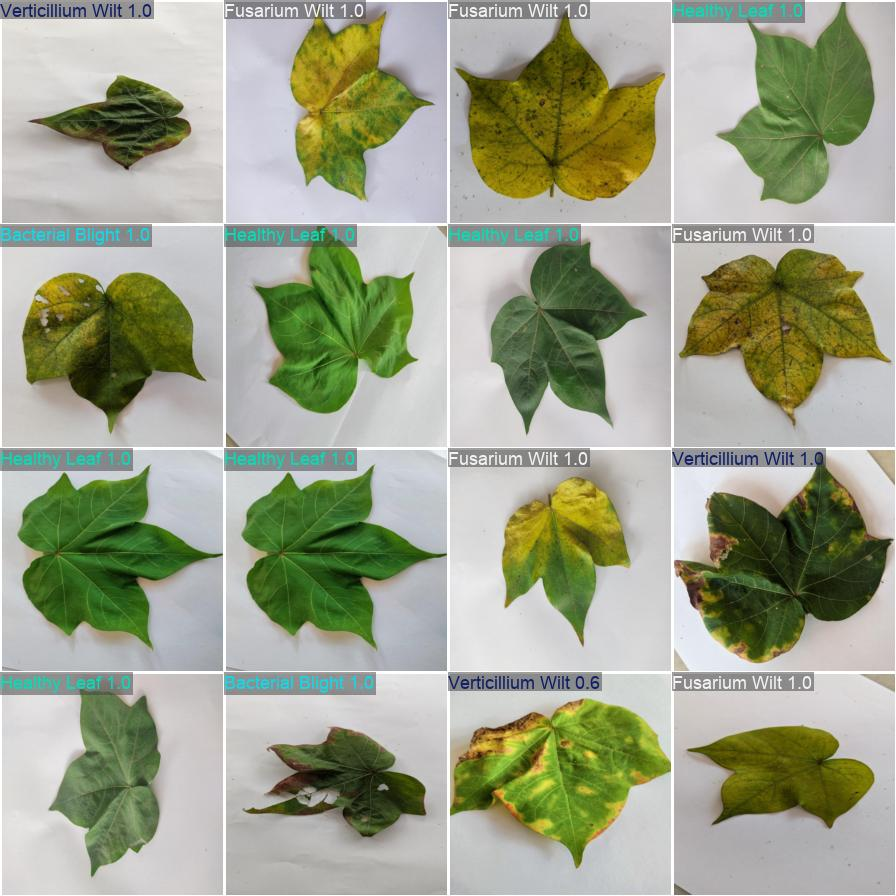

# Cotton Disease Classification (YOLOv8-cls)

This project trains a YOLOv8 classification model to identify cotton leaf diseases using folder-structured images (no bounding boxes). It includes data prep, training, verification, and a Streamlit inference app.

## Project Structure
- `Dataset/Cotton_Original_Dataset/` — source images in class folders.
- `yolo_dataset/` — generated YOLO classification splits (train/val/test).
- `data_prep.py` — creates the YOLO-formatted dataset splits.
- `train.py` — trains YOLOv8-cls.
- `verify.py` — runs CLI inference on a single image.
- `streamlit_app.py` — web UI for inference.
- `runs/classify/...` — training outputs (weights, logs).

## Dataset
- Source: `Dataset/Cotton_Original_Dataset/` with class folders:
  - Alternaria Leaf Spot (173 images)
  - Bacterial Blight (218)
  - Fusarium Wilt (337)
  - Healthy Leaf (333)
  - Verticillium Wilt (312)
- Data prep (`data_prep.py`) normalizes class names with underscores and splits into train/val/test. Default split is 70/15/15 with seed 42. Outputs to `yolo_dataset/`.
- Augmented set (optional): `Dataset/Cotton_Augmented_Dataset/` counts:
  - aug_Alternaria_Leaf (987 images)
  - aug_Bacterial_Blight (1027)
  - aug_Fusarium_Wilt (957)
  - aug_Healthy_Leaf (1015)
  - aug_Verticillium_Wilt (977)
  You can point `--source` in `data_prep.py` to this folder to build splits from augmented data instead of the original.

## Environment (conda, Python 3.12)
```bash
conda create -n cotton-yoLov8 python=3.12 -y
conda activate cotton-yoLov8
pip install torch torchvision torchaudio --index-url https://download.pytorch.org/whl/cpu
pip install ultralytics opencv-python pillow numpy matplotlib streamlit
```

## Data Preparation
Creates `yolo_dataset/train|val|test` with class subfolders and underscore-normalized names.
```bash
python data_prep.py --overwrite
# adjust ratios if needed, e.g. --train-ratio 0.75 --val-ratio 0.15
```

## Training
```bash
python train.py --epochs 3
# common flags: --batch 32 --imgsz 224 --name cotton_cls
```
Outputs saved under `runs/classify/<name>/weights/best.pt`.

## CLI Inference
```bash
python verify.py --weights runs/classify/<run>/weights/best.pt
# optional: --image path/to/image.png --topk 3 --imgsz 224
```

## Streamlit App
Launch from project root:
```bash
streamlit run streamlit_app.py
```
In the UI:
- Set weights path (defaults to `runs/classify/train3/weights/best.pt`, change if different).
- Upload an image or pick a sample from `yolo_dataset/test`.
- Set top-K and image size; click “Run Inference”.

## Results
- Latest run: `runs/classify/train3`
- Validation accuracy (top-1): ~0.97 (epoch 9 in `results.csv`)
- Validation accuracy (top-5): ~1.00
- Weights: `runs/classify/train3/weights/best.pt`

### Sample Validation Outputs
Confusion matrix (normalized):


Validation batch (labels vs predictions):



## Notes
- If `verify.py` cannot find weights, point `--weights` to the correct `best.pt`.
- For reproducible splits, `data_prep.py` uses seed 42 by default; change with `--seed`.
- If you need GPU training on a compatible system, install the appropriate PyTorch build and remove the CPU index URL.

